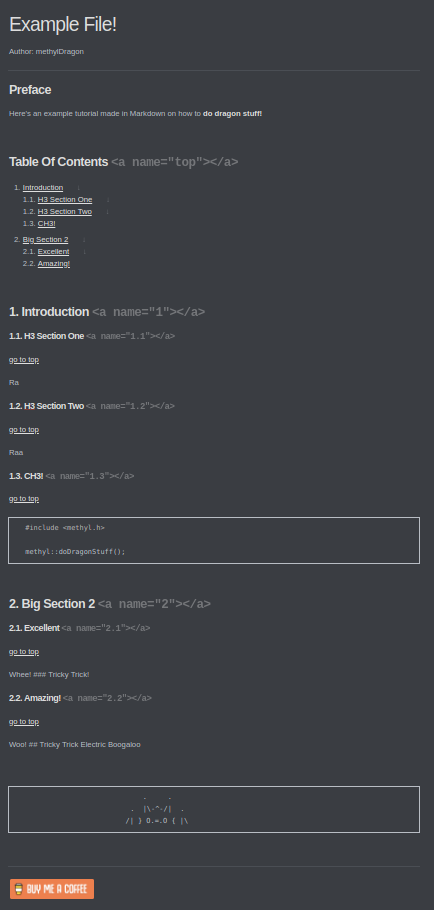

# markdown-linked-toc-adder
Add a linked Table of Contents to any GitHub flavoured Markdown file!


## What This Package Does

Suppose you have a Markdown file with nice headers. But they're all unlinked, and the file is thousands of words long. You don't want your readers to have to scroll through or desperately try to Ctrl-F.

**So why not create a linked Table of Contents that lets you get an overview <u>and click the links to jump to the relevant sections!</u>**

It even includes `go back to top` functionalities!

> This README was even processed with this script! WOW!


Check out this nifty **dynamically generated** Table of Contents Below!

## Table Of Contents <a name="top"></a>

1. [Check Out The Example!](#1)    
   1.1. [[Pre-Processed](Example/example.md)](#1.1)    
   1.2. [[Post-Processed](toc_example.md)](#1.2)    
2. [Usage](#2)    
   2.1. [Input Markdown Files](#2.1)    
   2.2. [Running the Script](#2.2)    


## 1. Check Out The Example! <a name="1"></a>

### 1.1. [Pre-Processed](Example/example.md) <a name="1.1"></a>
[go to top](#top)


### 1.2. [Post-Processed](toc_example.md) <a name="1.2"></a>
[go to top](#top)





## 2. Usage <a name="2"></a>

### 2.1. Input Markdown Files <a name="2.1"></a>
[go to top](#top)


1. This script **only processes on level 2 and level 3 headers for neatness' sake**

2. Just format your Markdown Files as needed, ensuring all your headers are formatted nicely.

3. Add a single line of "## Table Of Contents" where your want your Table of Contents to begin!

   1. The script will then process any headers that come **AFTER** that Table of Contents Line

      ```
      ## This header will not be processed
      .
      .
      .
      vvv Table of contents will be inserted here!
      ## Table Of Contents
      ^^^ Table of contents will be inserted here!
      
      
      ## This header will get processed
      ```

4. All Level 3 headers will have a [go to top](#top) link under them


### 2.2. Running the Script <a name="2.2"></a>
[go to top](#top)


You need **Python** to run the script

```shell
$ python linked_toc_adder.py <INPUT NAME> <OPTIONAL:OUTPUT NAME>
```

> If no output file is specified, the file that is output will be prepended with `toc_`


```
                            .     .
                         .  |\-^-/|  .    
                        /| } O.=.O { |\
```

​    

------

[.png)](https://www.buymeacoffee.com/methylDragon)